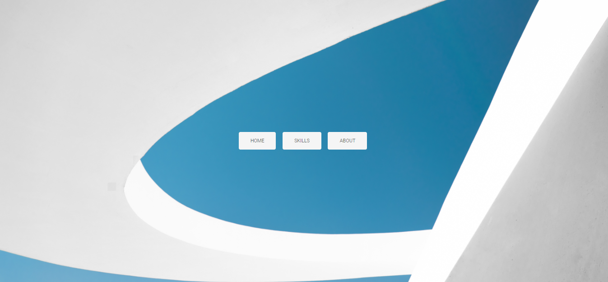
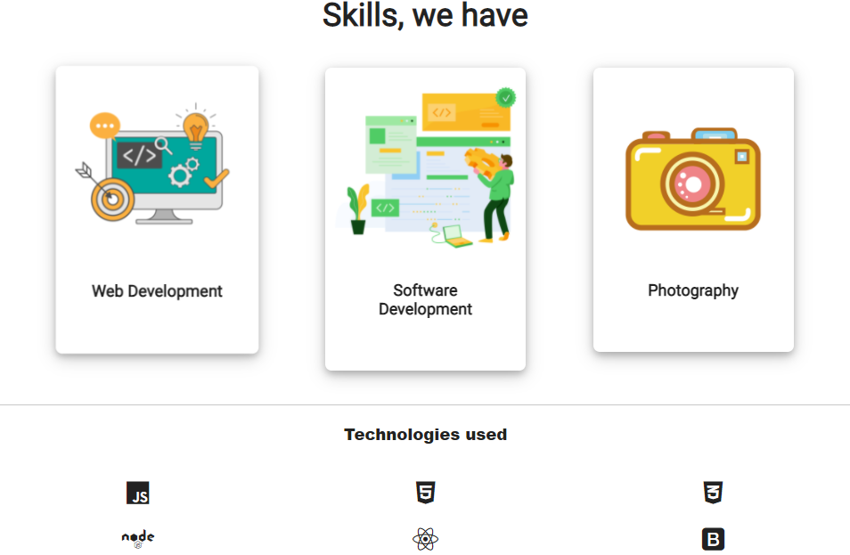

# React JS Portfolio

A team Portfolio, made using React JS
__Challenge 2__ given by <a href="https://developerdays.tech/">Developer Days</a> 5 week long Bootcamp + Hackathon

Tech Used : _HTML, CSS, JAVASCRIPT, React, Bootstrap_
Authors : _Ayush Som, Harshit Sharma_
 

# Deployment 
### LINK : https://risers.netlify.app/
 

# Screenshot

 